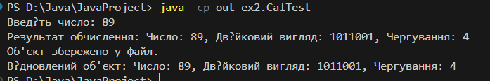
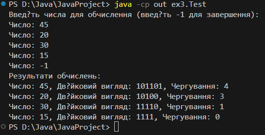

# Завдання 1

## 1)Підготувати сховище до розміщення проекту
## 2)Написати просту консольну програму (наприклад вивід на екран аргументів командної строки)

 

## 3)Прикріпити посилання на GIT та архівований проект
https://github.com/KabanovskiyI/JavaPractic

# Завдання 2
Завдання в папці ex2. Документація класів в папці doc.
## Підрахувати кількість чергувань 0 та 1 у двійковому поданні заданого десяткового числа.

### 1) Розробити клас, що серіалізується, для зберігання параметрів і результатів обчислень. Використовуючи агрегування, розробити клас для знаходження рішення задачі. 
Клас CalData перетворює десяткове число у двійковий код, та рахує кількість чергувань.
### 2) Розробити клас для демонстрації в діалоговому режимі збереження та відновлення стану об'єкта, використовуючи серіалізацію. Показати особливості використання transient полів. 
CalSolver клас для агрегації класу CalData. CalStorege клас для сеарелізації та десеарелізації.
### 3) Розробити клас для тестування коректності результатів обчислень та серіалізації/десеріалізації. Використовувати докладні коментарі для автоматичної генерації документації засобами javadoc.
CalTest клас для тестування попередніх класів.
### Результат

# Завдання 3
Завдання в папці ex3. Документація класів в папці doc.
## Основні завдання:
### 1) Як основа використовувати вихідний текст проекту попередньої лабораторної роботи. Забезпечити розміщення результатів обчислень уколекції з можливістю збереження/відновлення.
### 2) Використовуючи шаблон проектування Factory Method (Virtual Constructor), розробити ієрархію, що передбачає розширення рахунок додавання нових відображуваних класів.
### 3) Розширити ієрархію інтерфейсом "фабрикованих" об'єктів, що представляє набір методів для відображення результатів обчислень.
### 4) Реалізувати ці методи виведення результатів у текстовому вигляді.
### 5) Розробити та реалізувати інтерфейс для "фабрикуючого" методу.
## Основні зміни:
### 1) Оновлений клас CalSolver тепер результати зберігаються в List<CalData>.
### 2) Result клас який приймає список об'єктів, що дозволяє реалізаціям інтерфейсу виводити результати різними способами.
### 3) Text клас який виводить результати обчислень у консоль у текстовому форматі.
### 4) Test клас якмй приймає дані користувача та викликає та передає ці дані іншим класам.
## Результат
