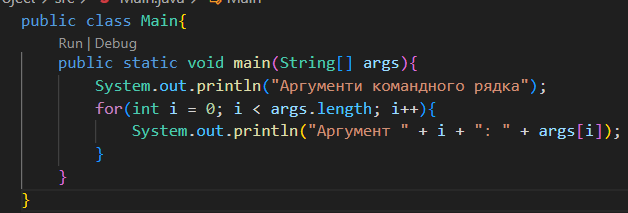

# Завдання 1

## 1)Підготувати сховище до розміщення проекту
## 2)Написати просту консольну програму (наприклад вивід на екран аргументів командної строки)

 

## 3)Прикріпити посилання на GIT та архівований проект